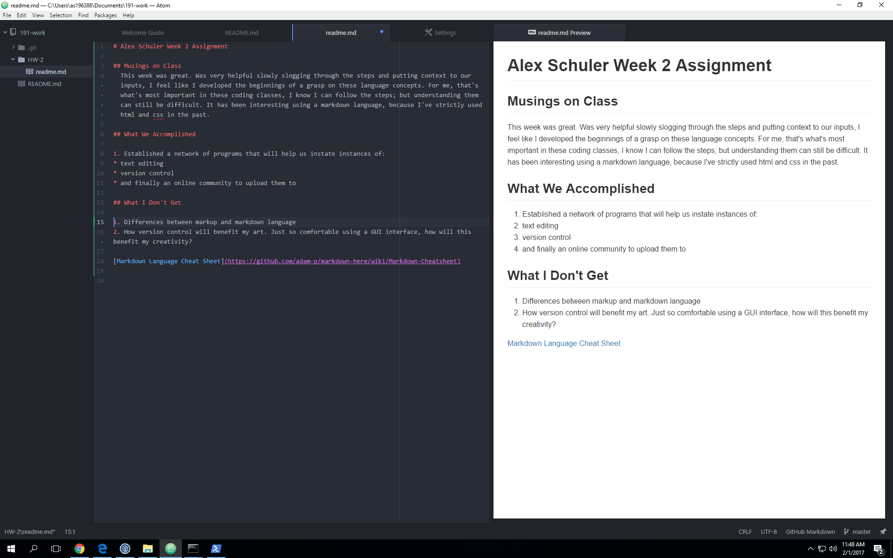

# Alex Schuler Week 2 Assignment

## Musings on Class
  This week was great. Was very helpful slowly slogging through the steps and putting context to our inputs, I feel like I developed the beginnings of a grasp on these language concepts. For me, that's what's most important in these coding classes, I know I can follow the steps; but understanding them can still be difficult. It has been interesting using a markdown language, because I've strictly used html and css in the past.

## What We Accomplished

1. Established a network of programs that will help us instate instances of:
* Text editing
* Version control
* And finally an online community to upload them to

## What I Don't Get

1. Differences between markup and markdown language
2. How version control will benefit my art. Just so comfortable using a GUI interface, how will this benefit my creativity?

[Markdown Language Cheat Sheet](https://github.com/adam-p/markdown-here/wiki/Markdown-Cheatsheet)

