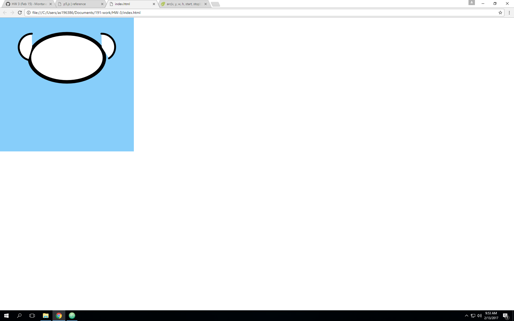
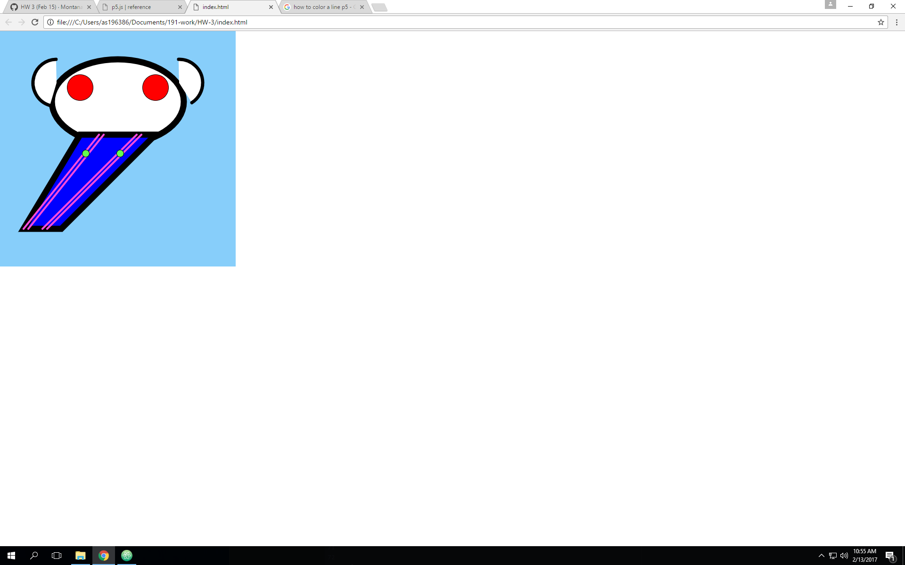
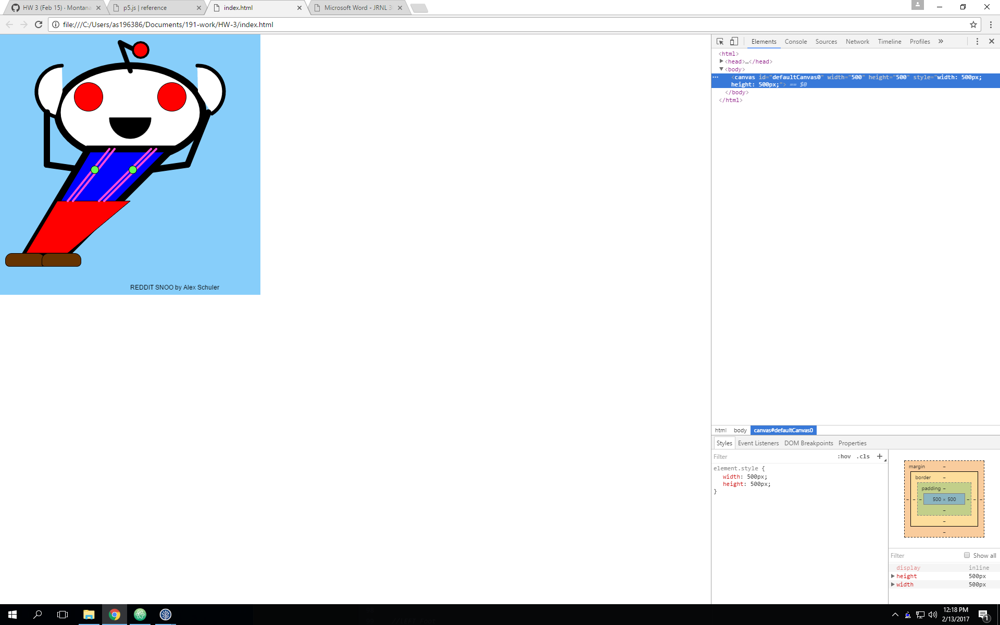

# Alex Schuler Week 3 Assignment

## Musings on Class
  This week was full of toolset building. We went through a bunch of different shape and design functions to help us create. I think if we had time to slow down and play with these new tools it might solidify this new language set before we move on. There's so much more we could learn playing with arcs and bezier curves, they are complicated functions that are rewarding to understand.

## What We Accomplished

1. Learned new p5 language:
* Shapes: Lines, Triangles, Arcs, etc..
* Variable Control (x=FirstVariable)
* Transformation functions

## What I Don't Get Yet

1. Geometry. I keep having to blindly guess my inputs for arcs and bezier curves until I get them where I want them.
2. Difference between draw and setup functions

[p5 Reference Sheet](https://p5js.org/reference/)

My Development Process. Using Arcs=Hard

